<section data-background="BuurmaImage2.jpg"></section>

---

### What Was Distant Reading?

 
 <small>Rachel Sagner Buurma, Department of English Literature, Swarthmore College [@rbuurma](http://twitter.com/rbuurma)</small>
 
 <small>Laura Heffernan, Department of English Literature, University of North Florida [@LAHeffernan](http://twitter.com/rbuurma)</small>
 
 
 
<small>Slides at [rbuurma.github.io/presentations/SmallerWorlds.html](rbuurma.github.io/presentations/DistantReading.html)</small>

---

### Edith Rickert (1871-1938)

---

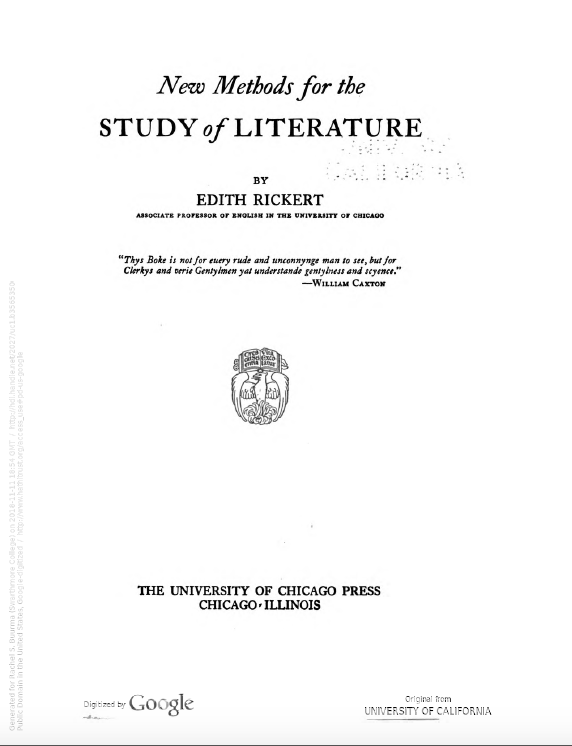

---

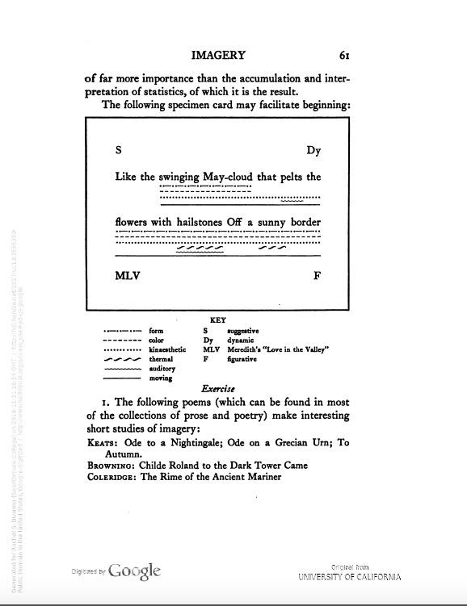

---

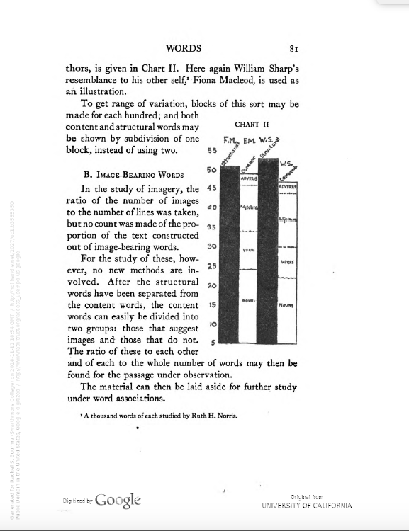

---

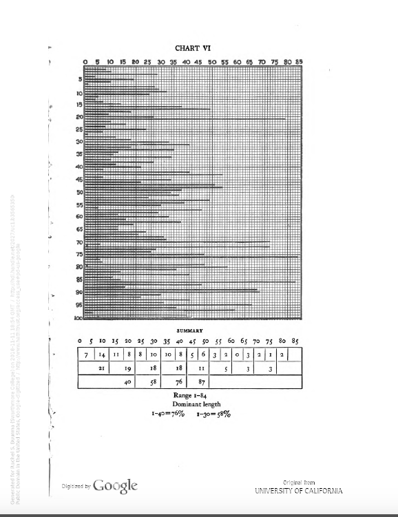

---

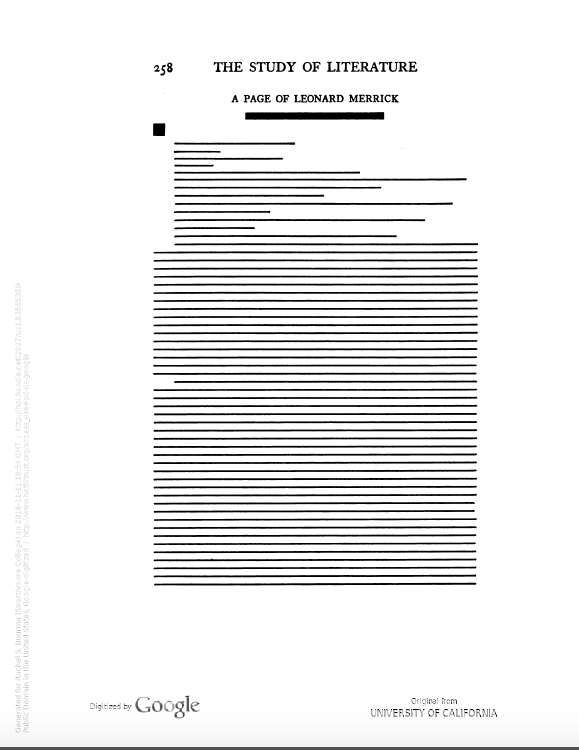

---

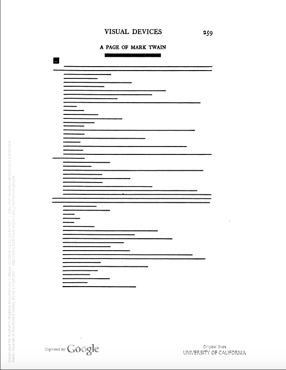

---

### Caroline Spurgeon (1869-1942)

---

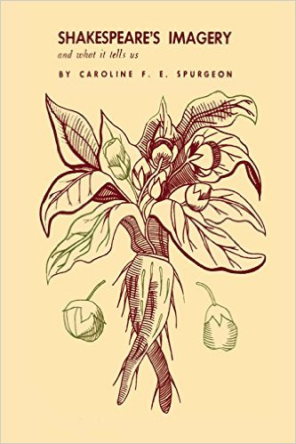

---

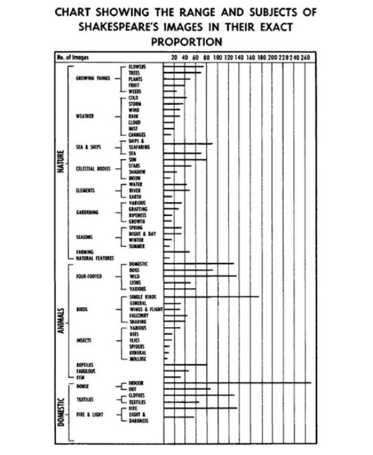

---

### Josephine Miles (1911-1985)

---

---

---

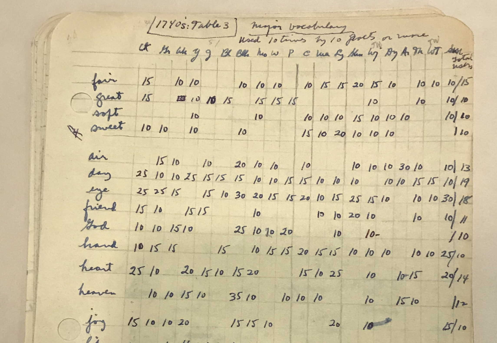

---

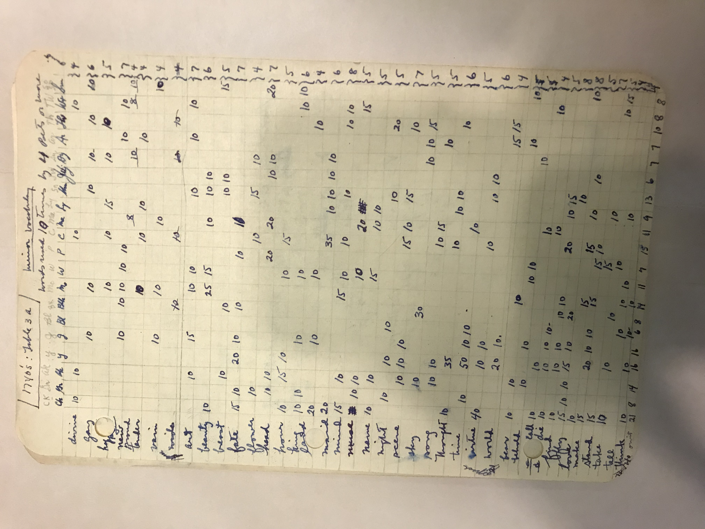

---

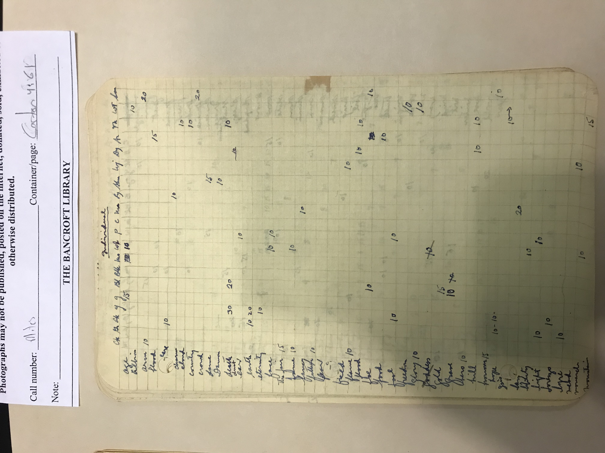

---

### Works Cited:

Sarah Allison, *Reductive Reading: A Syntax of Victorian Moralizing*. Baltimore: Johns Hopkins University Press, 2018.

Rachel Sagner Buurma and Laura Heffernan, "Search and Replace: Josephine Miles and the Origins of Distant Reading"

https://modernismmodernity.org/forums/posts/search-and-replace

Jay Jin, "Problems of Scale in 'Close' and 'Distant' Reading." Philological Quarterly 96.1 (2017)

Ted Underwood, David Bamman, and Sabrina Lee, "The Transformation of Gender in English-Language Fiction," Journal of Cultural Analytics. Feb. 13, 2018. DOI: 10.31235/osf.io/fr9bk

---

<small>[Link to Sources for Images]()</small>
