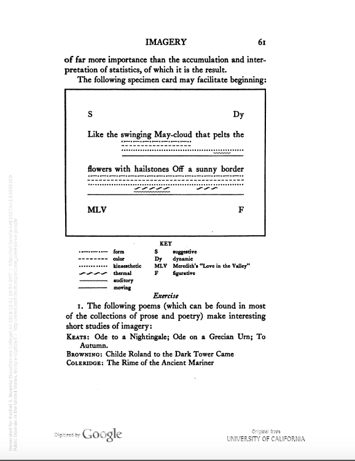
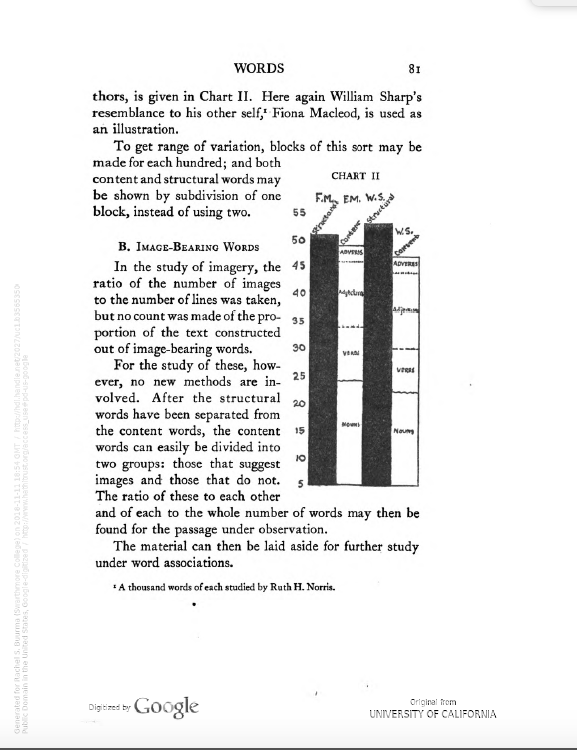
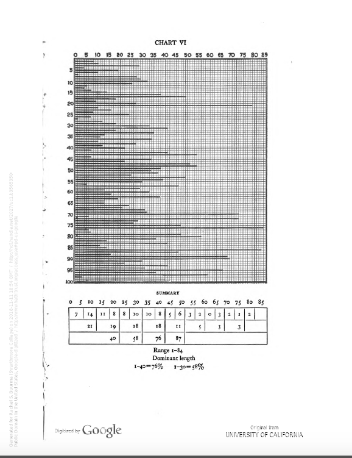
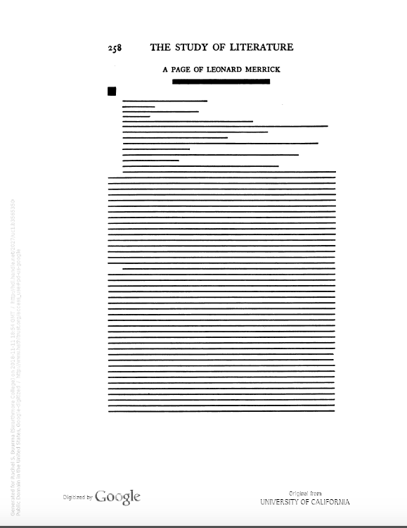
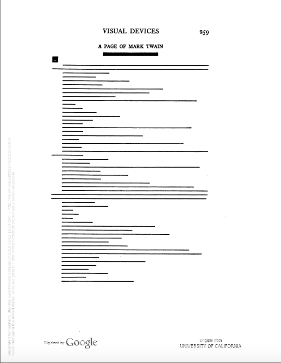
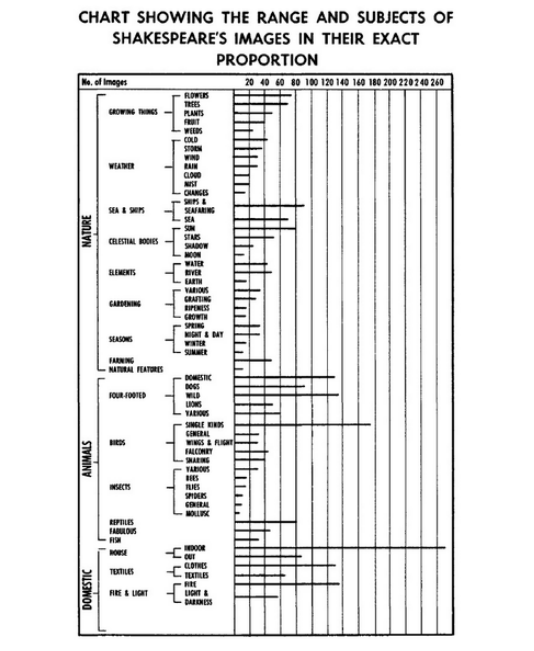
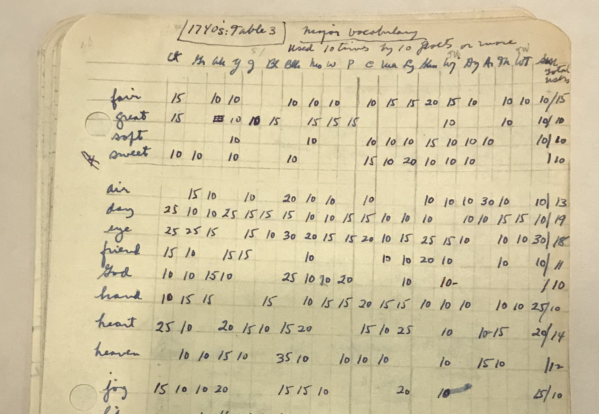
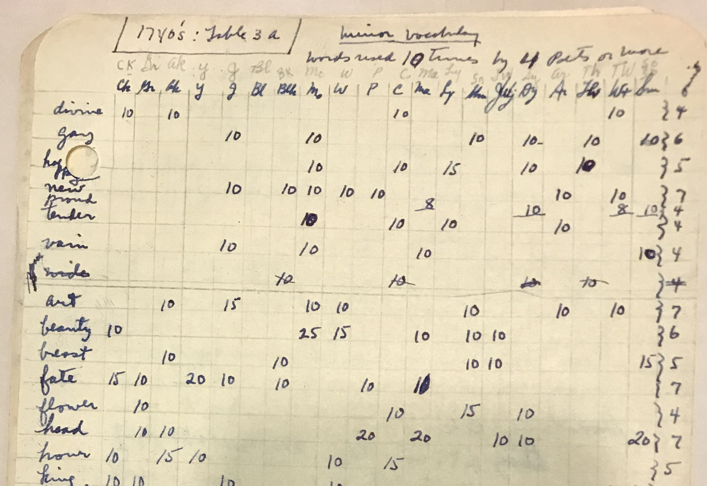
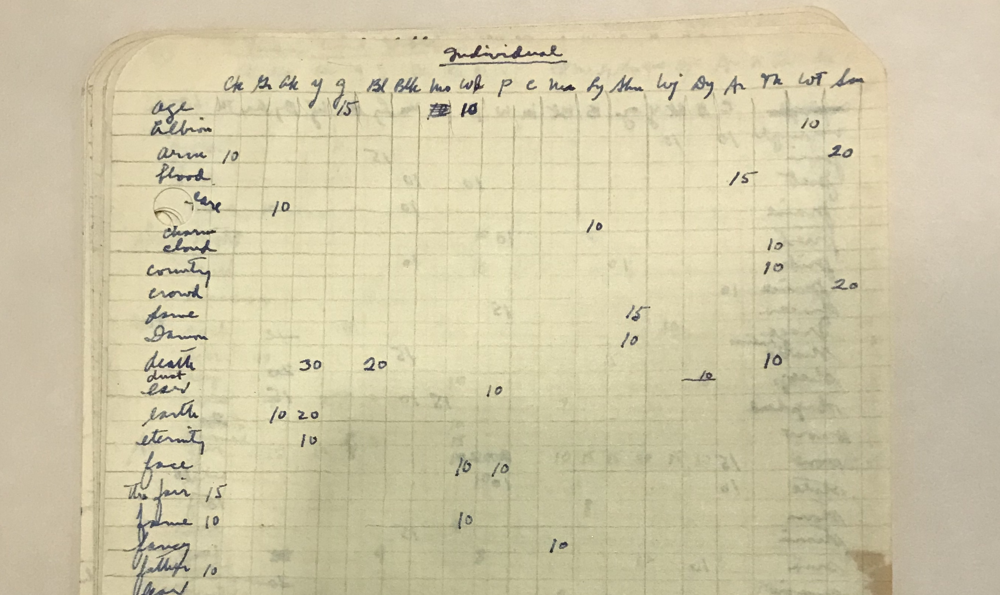

<section data-background="BuurmaImage2.jpg"></section>

---

### What Was Distant Reading?

 
 <small>Rachel Sagner Buurma, Department of English Literature, Swarthmore College [@rbuurma](http://twitter.com/rbuurma)</small>
 
 <small>Laura Heffernan, Department of English Literature, University of North Florida [@LAHeffernan](http://twitter.com/rbuurma)</small>
 
 
 
<small>Slides at [rbuurma.github.io/presentations/SmallerWorlds.html](rbuurma.github.io/presentations/DistantReading.html)</small>

---

### Edith Rickert (1871-1938)

---

---

---

---

---

---

---

### Caroline Spurgeon (1869-1942)

---

---

---

### Josephine Miles (1911-1985)

---

> Then I developed a whole theory that I wanted to follow out, the one of major language. Then I just had a built-in job to do every summer. I sat on the patio with my little beat-up traveling typewriter that had only three banks of keys, and typed out these studies of the language of the poets of the 1640s, 1740s, and so on. These were good for getting - I wanted something too, not only that I liked to do, that I could sit outside with and enjoy, but also that students could help with so that they could get support grant money and this kind of analysis of language they could do. Over the years, in fear and trembling, I've gone back and checked whether they did it well, and on the whole I’m sure there are terrible errors still but on the whole they did beautifully. They were responsible and good people. I just did that until about 1951, I guess; for about a decade I did that, and then additions through the sixties.

---

---

---

---

---

---

### Works Cited

Sarah Allison, *Reductive Reading: A Syntax of Victorian Moralizing*. Baltimore: Johns Hopkins University Press, 2018.

Rachel Sagner Buurma and Laura Heffernan, "Search and Replace: Josephine Miles and the Origins of Distant Reading"

https://modernismmodernity.org/forums/posts/search-and-replace

Josephine Miles, *The Continuity of Poetic Language.* University of California Press, 1951.

Stephen Ramsay, *Reading Machines: Toward an Algorithmic Criticism.* University of Illinois Press, 2011.

Edith Ricert, *New Methods for the Study of Literature.* Chicago: The University of Chicago Press, 1927.

Caroline Spurgeon, *Shakespeare's Imagery and What It Tells Us.* London: Cambridge University Press, 1935.

Ted Underwood, "Distant Reading and Recent Intellectual History" in *Debates in DH*, edited by Matt Gold and Lauren Klein, 2016.

http://dhdebates.gc.cuny.edu/debates/text/95
---

<small>[Link to Sources for Images]()</small>
