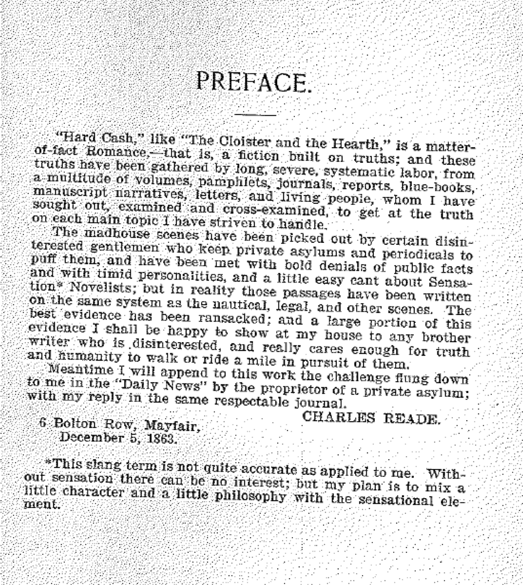
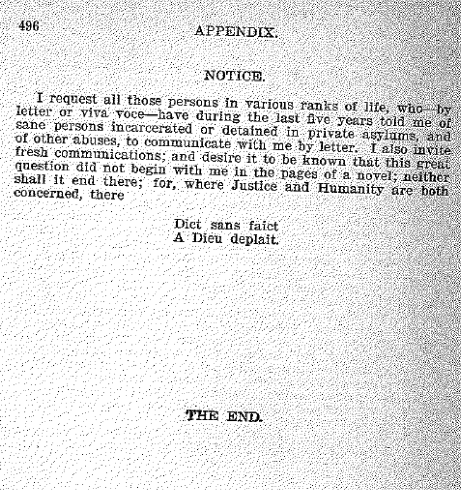

<section data-background="BuurmaImage2.jpg"></section>

---

### The Preparation of the Victorian Novel

<small>Follow along at [rbuurma.github.io/presentations/Reade2017.html](rbuurma.github.io/presentations/Reade2017.html)</small>
 
 <small>Rachel Sagner Buurma, Department of English Literature, Swarthmore College [@rbuurma](http://twitter.com/rbuurma)</small>
 
 <small>[rachelsagnerbuurma.org](http://rachelsagnerbuurma.org)</small>

---

<section style="text-align: left;">Replacing "How something is made, with a view to finding out what it is" with "How something is made, with a view to making it again" - the Essence with the Preparation - is linked to an option that's completely antiscientific: in reality, the starting point of the Fantasy [of the critic's writing of a novel] isn't the Novel (in general, as a genre), but one or two novels out of thousands.
 
 
Roland Barthes, The Preparation of the Novel, Session of December 9, 1978, 13

---

<section style="text-align: left;">1. In its most elevated conception (Dante, Mallarme, Proust), The Book is a representation of the universe; the book is homologous to the world. To want the "architectural and premeditated" Book is to conceive of and to want One universe, one that's structured, hierarchically ordered.
 
 
2. In its way, the Album represents the opposite: a universe that is not-one, not-ordered, scattered, a pure interweaving of contingencies, with no transcendence.
 
 
Roland Barthes, The Preparation of the Novel, Session of December 9, 1978, 189

---

[In case you would like to listen to those lectures.](http://www.openculture.com/2014/07/listen-to-roland-barthes-deliver-his-40-hour-lecture-course-la-preparation-du-roman-in-french-1978-80.html)

---

---

---

---

---

---

---

---

---

---

---

---

---

---

---

---

---

---

---

---

---

---

<small>[Link to Sources for Images]()</small>
