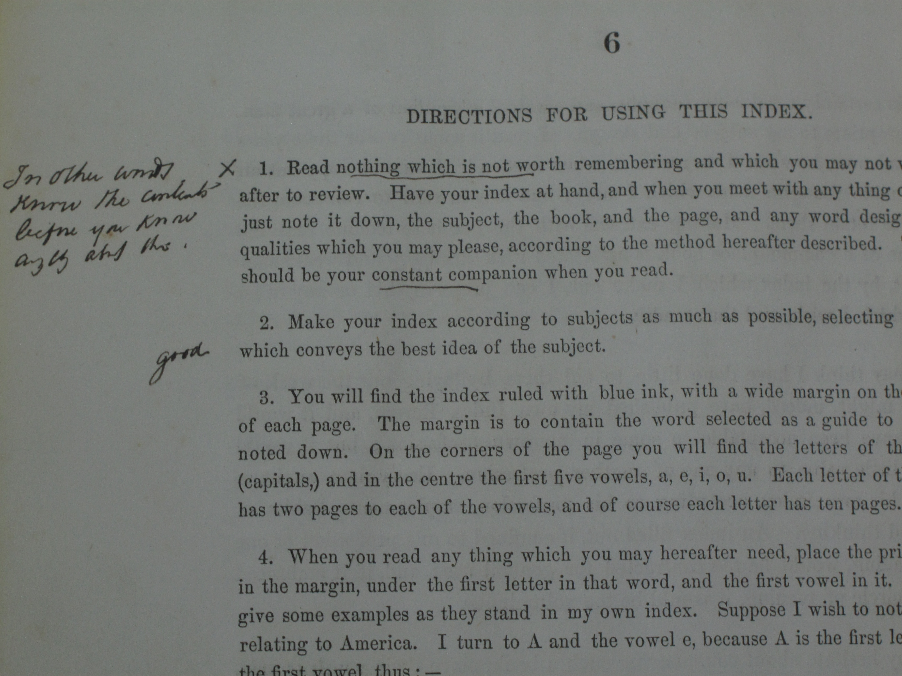
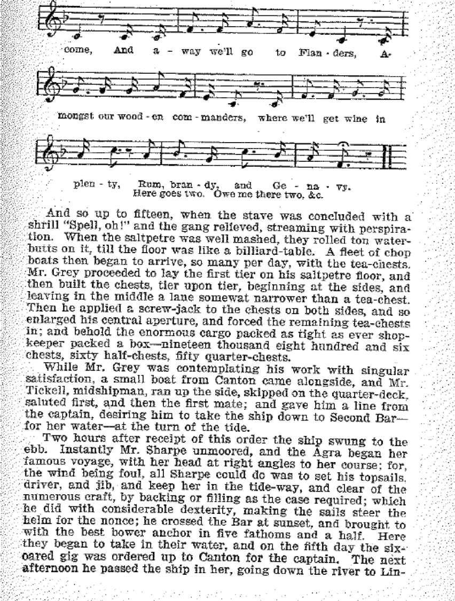
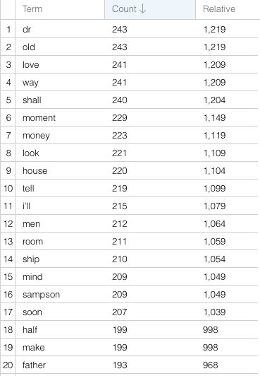
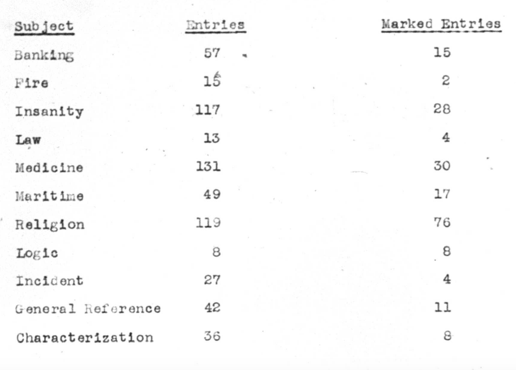
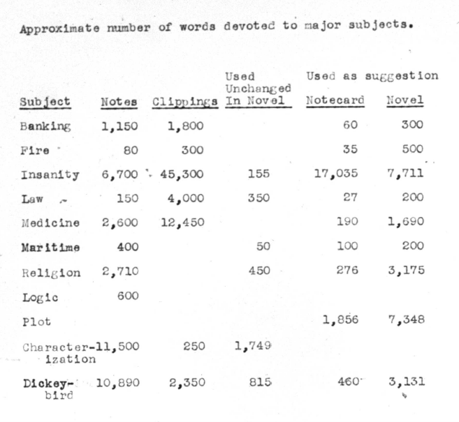
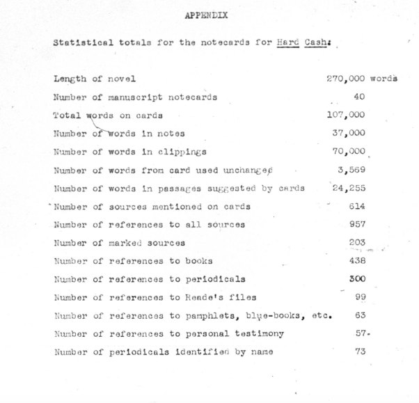

section data-background="BuurmaImage2.jpg"></section>

---

### The Preparation of the Victorian Novel

<small>Follow along at [rbuurma.github.io/presentations/Reade2017.html](rbuurma.github.io/presentations/Reade2017.html)</small>
 
 <small>Rachel Sagner Buurma, Department of English Literature, Swarthmore College [@rbuurma](http://twitter.com/rbuurma)</small>
 
 <small>[rachelsagnerbuurma.org](http://rachelsagnerbuurma.org)</small>

---

<section style="text-align: left;">Replacing "How something is made, with a view to finding out what it is" with "How something is made, with a view to making it again" - the Essence with the Preparation - is linked to an option that's completely antiscientific: in reality, the starting point of the Fantasy [of the critic's writing of a novel] isn't the Novel (in general, as a genre), but one or two novels out of thousands.
 
 
Roland Barthes, The Preparation of the Novel, Session of December 9, 1978, 13

---

<section style="text-align: left;">1. In its most elevated conception (Dante, Mallarme, Proust), The Book is a representation of the universe; the book is homologous to the world. To want the "architectural and premeditated" Book is to conceive of and to want One universe, one that's structured, hierarchically ordered…
 
2. In its way, the Album represents the opposite: a universe that is not-one, not-ordered, scattered, a pure interweaving of contingencies, with no transcendence.
 
 
Roland Barthes, The Preparation of the Novel, Session of December 9, 1978, 189

---

[In case you would like to listen to those lectures.](http://www.openculture.com/2014/07/listen-to-roland-barthes-deliver-his-40-hour-lecture-course-la-preparation-du-roman-in-french-1978-80.html)

---

<section style="text-align: left;">Very incomplete list of references to work on research and reference, especially in relation to fiction:

+ Buurma and Heffernan, [Notation After "The Reality Effect": Remaking Reference with Roland Barthes and Sheila Heti](http://works.swarthmore.edu/cgi/viewcontent.cgi?article=1171&context=fac-english-lit)

+ *Representations* special issue "Denotatively, Technically, Literally" edited by Elaine Freedgood and Canon Schmidt, and including essays by Canon Schmidt, Elaine Freedgood, Ian Duncan, and Margaret Cohen

+ Deidre Lynch, *Loving Literature: A Cultural History*

+ Leah Price, *The Anthology and the Rise of the Novel*

+ Susan David Bernstein's *Roomscape: Women Writers in the British Museum from George Eliot to Virginia Woolf*

+ Simon Reader's Victorian writers'notebooks, including [Social Notes: Oscar Wilde, Francis Bacon, and the Medium of Aphorism](http://www.tandfonline.com/doi/abs/10.1080/13555502.2013.860394)

+ [Sierra Eckert's](https://sceckert.github.io/) in-progress work on the nineteenth-century archival imagination.

+ Anna Gibson's [Dickens Notes Project](http://dickensnotes.com/).

+ And lots of work on histories of knowledge organization including Ann Blair's *Too Much To Know*, Ronald Day's *Indexing It All*, Lisa Gitelman's *Paper Knowledge*...

---

---

---

---

---

---

---

---

---

---

---

---

---

---

---

---

<section style="text-align: left;">In a snowy villa, with a sloping lawn, just outside the great commercial
seaport, Barkington, there lived a few years ago a happy family. A
lady, middle-aged, but still charming; two young friends of hers; and a
periodical visitor.
 
 
The lady was Mrs. Dodd; her occasional visitor was her husband; her
friends were her son Edward, aged twenty, and her daughter Julia,
nineteen, the fruit of a misalliance.

Charles Reade, *Hard Cash*, first page

---

---

---

---

---

---

---

---

---

<small>[Link to Sources for Images]()</small>
