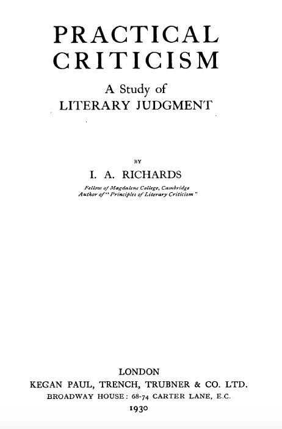

<section data-background="RickertNotebooks.jpg"></section>

---

### The Teaching Archive: a new history of literary study
#### a handful of images and ideas

<small>Follow along at [rbuurma.github.io/presentations/TeachingArchiveSwarthmore2018.html](rbuurma.github.io/presentations/Reade2017.html)</small>
 
 <small>Rachel Sagner Buurma, Department of English Literature, Swarthmore College [@rbuurma](http://twitter.com/rbuurma)</small>
 
 <small>Laura Heffernan, Department of English, University of North Florida [@LAHeffernan](http://twitter.com/LAHeffernan)</small>

---

---

---

---

---

---

---

---

---

---

---

---

<section style="text-align: left;">
English 411: American Literature. This is a survey of American prose and poetry beginning with the most important present day Negro writers and going back the most effective writers of the Colonial period. The course, conducted by lectures, socialized recitations, individual and group reports, and panel discussions, approaches literature in such a way as to give the student an appreciation of the fullness of life in the United States, together with sufficient historical and biographical material to meet the needs of prospective teachers and to place writers in proper perspective. Considerable time and emphasis are given to the contributions of Negro writers, and these are treated as an integral part of American literature. Although the course is designed primarily for prospective teachers, it is admirably suited to the needs of those interested in the cultural heritage of the race.
 
 
Hampton Bulletin, May 1941 (Course Catalog for 1941-42)

---

---

---

---

---

<small>[Link to Sources for Images]()</small>
