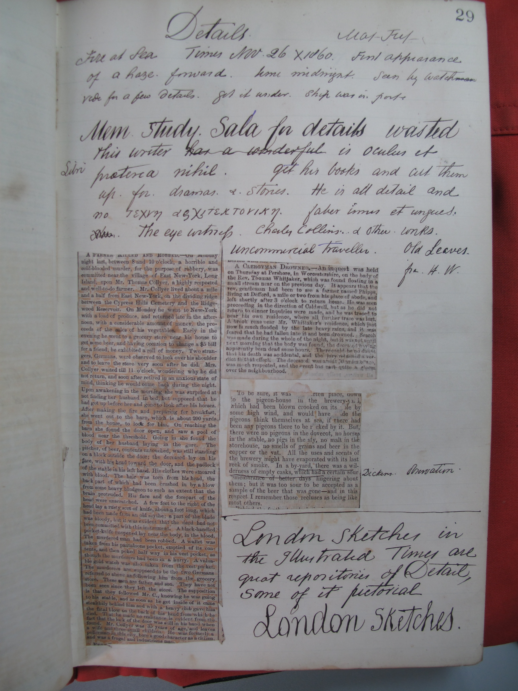
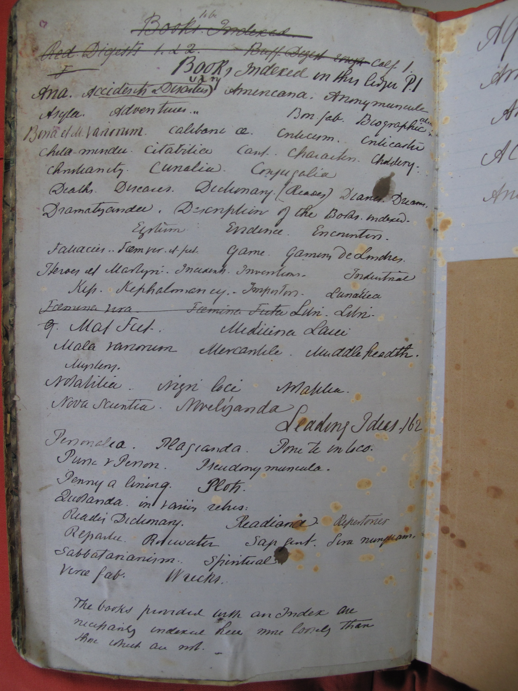
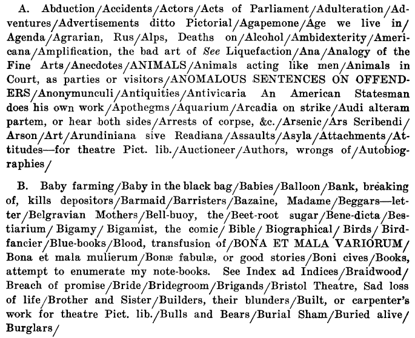
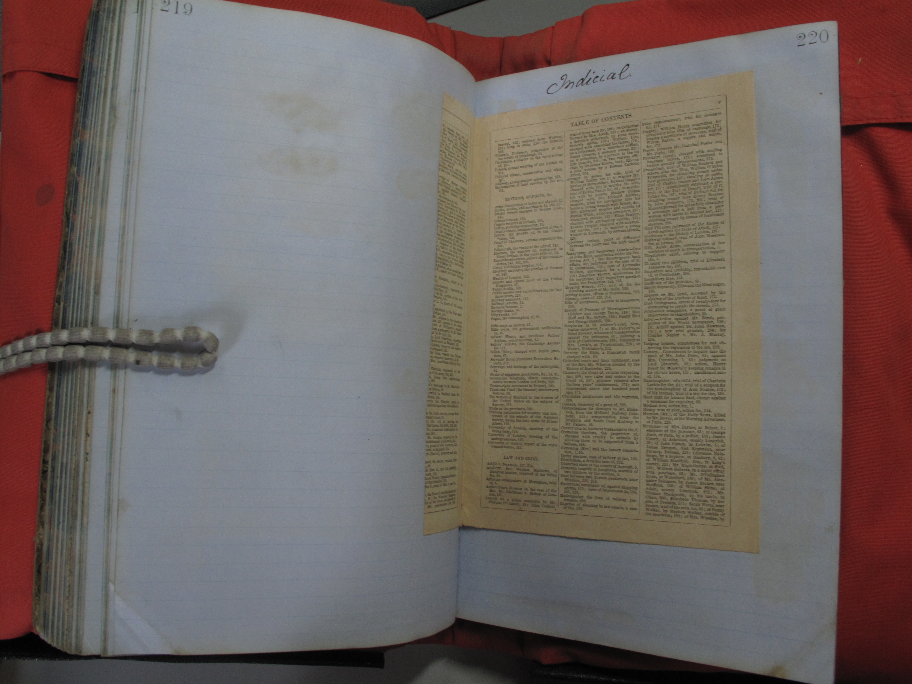

<section data-background="BuurmaImage2.jpg"></section>

---

## Henry Wheatley's General Index: Knowledge Organization, Fictional Representation, and Information Utopianism in the 1870s

<small>Follow along at [rbuurma.github.io/presentations/delaware.html](http://theotherdh.com/presentations/Wheatley.html)</small>
 
 <small>Rachel Sagner Buurma, Department of English Literature, Swarthmore College [@rbuurma](http://twitter.com/rbuurma)</small>

---

If you have questions while I'm speaking, feel free to

---

---

## some heading

---

---

> Some text

---

---

---

---

## some heading

---

---

> some text

---

---

---

---

---

---

---

---

---

---

---

---

---

---

---

---

---

---

---

---

<section data-background="eniacwomen.jpg"></section>
## fin fin fin

---

<small>[Link to Sources for Images]()</small>
