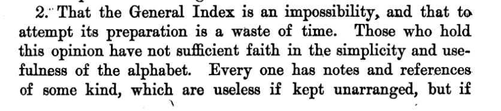
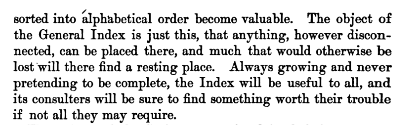
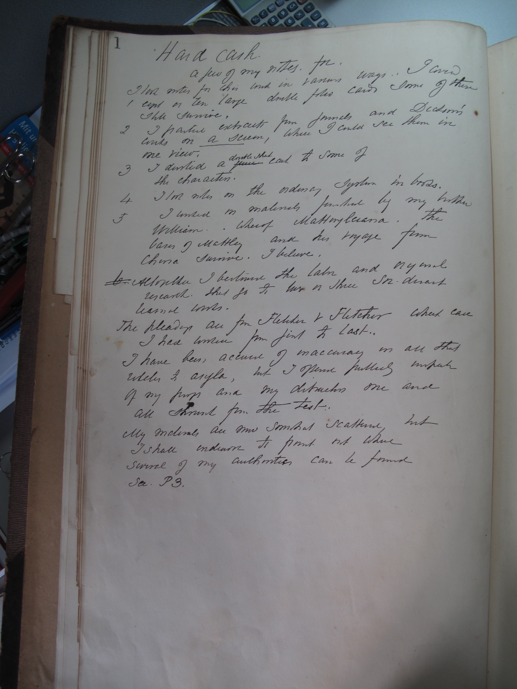

<section data-background="BuurmaImage2.jpg"></section>

---

### Henry Wheatley's General Index, Charles Reade's Personal Indices: 
### Knowledge Organization, Fictional Representation, and Information Utopianism in the 1870s

<small>Follow along at [rbuurma.github.io/presentations/Wheatley.html](http://theotherdh.com/presentations/Wheatley.html)</small>
 
 <small>Rachel Sagner Buurma, Department of English Literature, Swarthmore College [@rbuurma](http://twitter.com/rbuurma)</small>
 
 <small>[rachelsagnerbuurma.org](http://rachelsagnerbuurma.org)</small>

---

If you have an urgent question while I'm speaking, do feel free to

---

---

---

---

---

---

---

---

from John McVey http://jmcvey.net/rerum/index.htm

---

---

---

---

---

---

---

---

---

---

---

---

---

---

---

---

---

---

---

---

<section data-background="eniacwomen.jpg"></section>
## fin fin fin

---

<small>[Link to Sources for Images]()</small>
