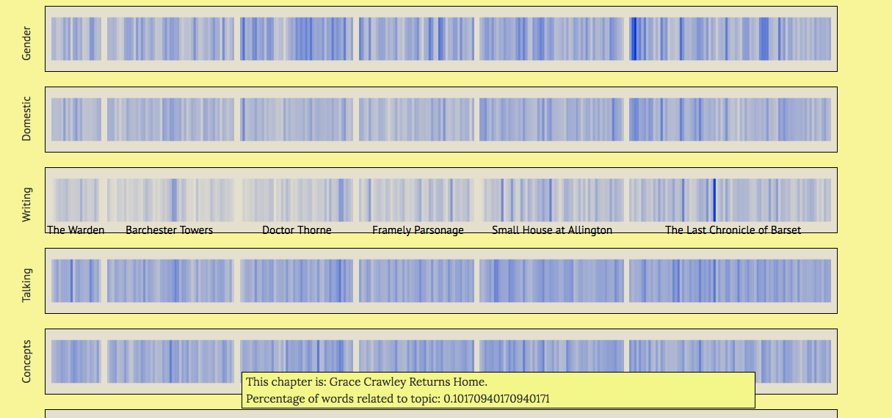
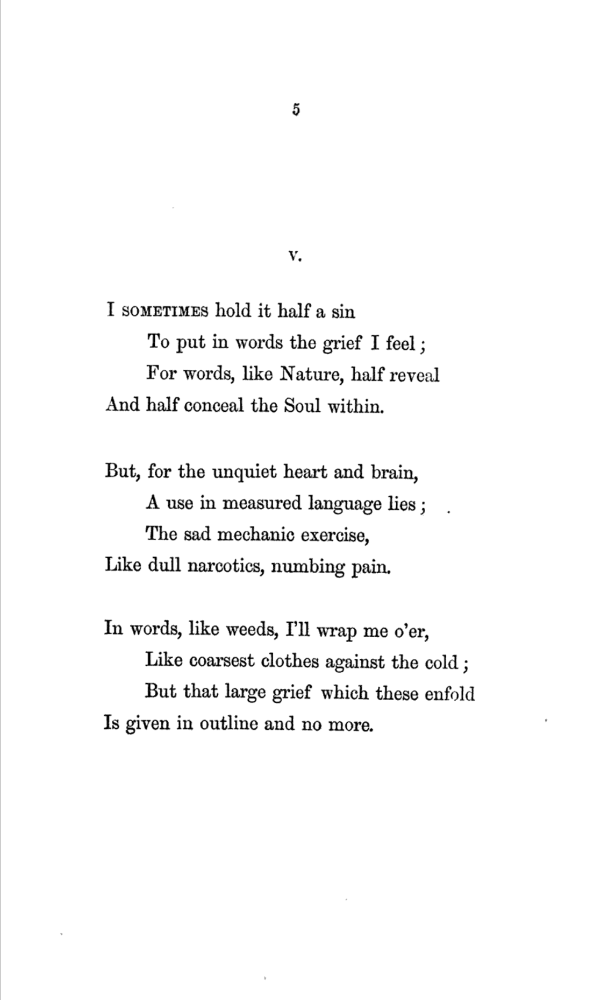
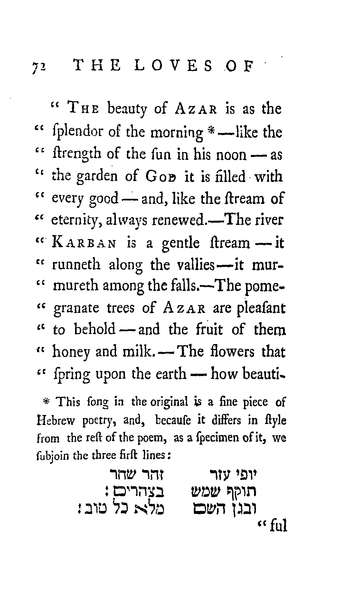
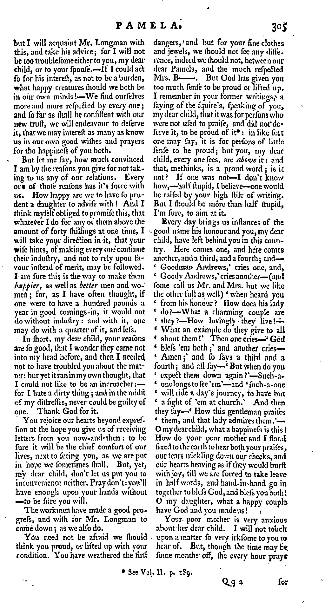
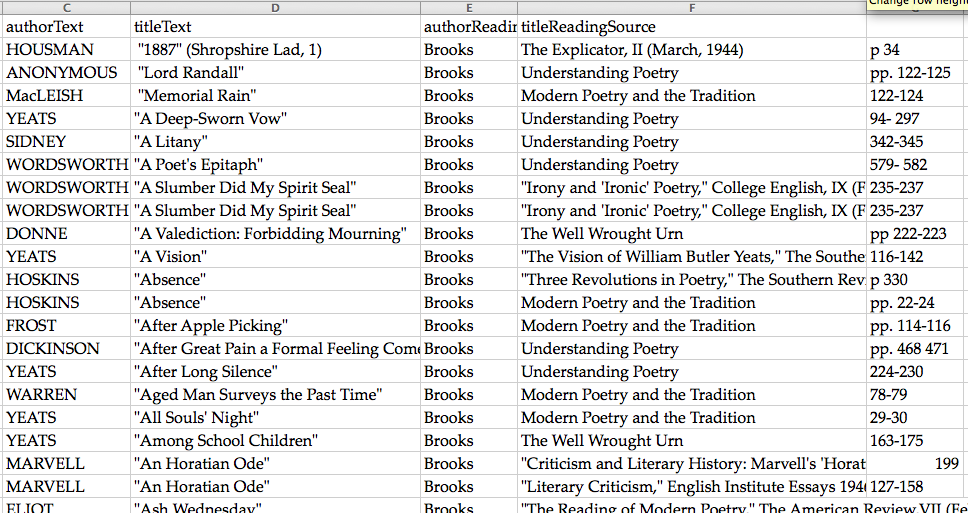

<section data-background="BuurmaImage2.jpg"></section>

---

# how to think like a humanist about information

---

_or_

---

## contingent models, counterfactual algorithms, and uncertain visualizations

<small>Follow along at [rbuurma.github.io/presentations/newschool.html](http://theotherdh.com/presentations/newschool.html)</small>
 
 <small>Rachel Sagner Buurma, Department of English Literature, Swarthmore College [@rbuurma](http://twitter.com/rbuurma)</small>

---

## some ways humanists think about information 

---

> When you call something data, you imply that it exists in discrete, fungible units; that it is computationally tractable; that its meaningful qualities can be enumerated in a finite list; that someone else performing the same operations on the same data will come up with the same results. This is not how humanists think of the material they work with.

<small>Miriam Posner, ["Humanities Data: A Necessary Contradiction"](http://miriamposner.com/blog/humanities-data-a-necessary-contradiction/)</small>

---

> In the twentieth century, the difficulty of representing unstructured text divided the quantitative social sciences from the humanities. Sociologists could use numbers to understand social mobility or inequality, but they had a hard time connecting those equations to the larger and richer domain of human discourse. Over the last twenty years, that barrier has fallen. A theory of learning that emphasizes generalization has shown researchers how to train models that have thousands of variables without creating the false precision called "overfitting." That conceptual advance would be interesting in itself. But it also allows researchers to include qualitative evidence like text in a quantitative model by the simple expedient of using lots of variables (say, one for each word).Social scientists can now connect structured social evidence to loosely structured texts or images or sounds, and they’re discovering that this connection opens up fascinating questions. Humanists are discovering the same thing.

<small> Ted Underwood, ["Distant Reading and Recent Intellectual History,"](http://dhdebates.gc.cuny.edu/debates/text/95) Debates in DH</small>

---

If you have questions while I'm speaking, feel free to

 ---

## contingent models: topology

---

[<small>Andrew Piper and Mark Algee-Hewitt, "The Werther Effect I: Goethe, Objecthood, and the Handling of Knowledge."</small>](http://piperlab.mcgill.ca/pdfs/WertherEffect1.pdf)

---

> We are interested in the extent to which the language of a particular work or concept...circulates within a given environment and structures a given literay field. Rather than look at only those works that claim to be Wertherian, we are interested in mapping Werther's discursive presence in a more diffuse, less explicit sense.

[<small>Andrew Piper and Mark Algee-Hewitt, "The Werther Effect I: Goethe, Objecthood, and the Handling of Knowledge.[</small>](http://piperlab.mcgill.ca/pdfs/WertherEffect1.pdf)
---

[<small>Andrew Piper and Mark Algee-Hewitt, "The Werther Effect I: Goethe, Objecthood, and the Handling of Knowledge."</small>](http://piperlab.mcgill.ca/pdfs/WertherEffect1.pdf)

---

> ...reading topologically illustrates the way a contingent object brings into view a contingent environment, which is then used recursively to interpret that initial object. Not only are there other Wertherisms lurking in our topology waiting to be uncovered; there are other Wertherisms waiting to be brought to light when we model Werther differently. 

[<small>Andrew Piper and Mark Algee-Hewitt, "The Werther Effect I: Goethe, Objecthood, and the Handling of Knowledge."</small>](http://piperlab.mcgill.ca/pdfs/WertherEffect1.pdf)

---

## counterfactual algorithms: topic modeling

---

[David Mimno and Matt Jockers, 500 topics in ~3000 novels](https://mimno.infosci.cornell.edu/novels/plot.html)

Note: no notes here

---

 
 

---

[Visualization of very handmade topics in Anthony Trollope's The Barsetshire Chronicles](http://trainorpj.github.io/barsetshire-series/)
 
 
Created by PJ Trainor in collaboration with the [Swarthmore College Victorian Novels Research Seminar](http://vic-sem-2016.github.io/) and [Nabil Kashyap](http://www.nabilk.com/)

---

## supervised machine learning 

---

## humans and machines looking at pages: visual image processing

---

[Tim Sherratt's Open with Exception project](owebrowse.herokuapp.com)

---

<small>[The Visual Page Project, Neal Audenaert and Natalie M. Houston](http://nmhouston.com/visual-page/)</small>

---
lots and lots of footnotes in eighteenth-century novels
---

---

---

---

---

---

---

---

---

<small>from [Andrew Piper, "Footnote Detection," .txtLab@McGill blog](http://txtlab.org/?p=395)</small>
---

## visualizing uncertaintly, outliers, + diversity 

---

add topotime image here?

---

add favored traces here?

---

---

---

 
 

reusing analog indexes

---

(your idea here)

---

new histories for thinking like a humanist about information

---

<section data-background="BuurmaImage2.jpg"></section>
<bold>[Henry Morley, Tables of English Literature (1870)](https://catalog.hathitrust.org/Record/001397737/Home)
</bold>

---

---

Rickert?

---

Ann Blair, Leah Price, Robin Valenza, Richard Menke, Janine Barchas, Chad Wellmon

---

Shannon Mattern, Bookshelves to Big Data: Archeologies of Knowledge

---

<section data-background="eniacwomen.jpg">
fin fin fin 
</section>

---

<small>[Link to Sources for Images; all CC.]()</small>
