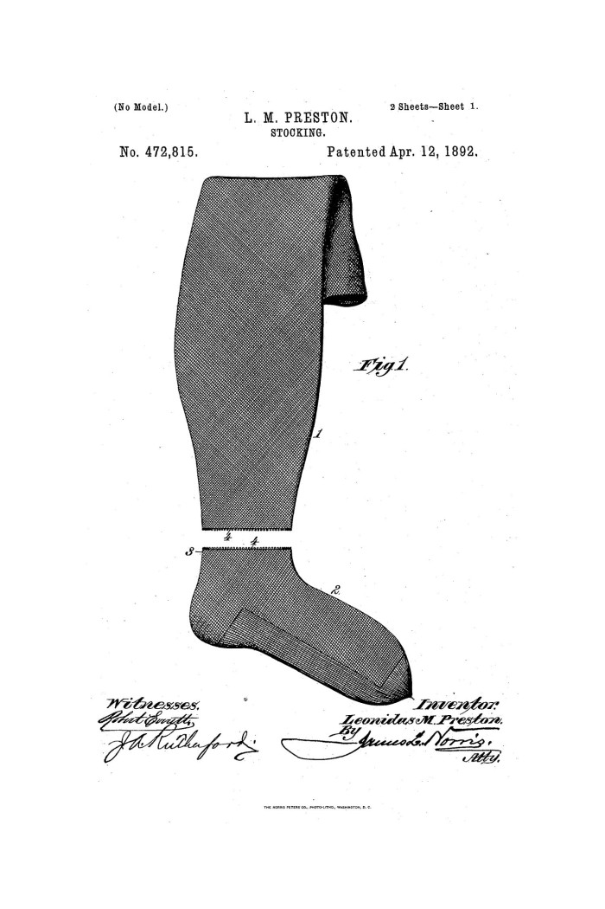
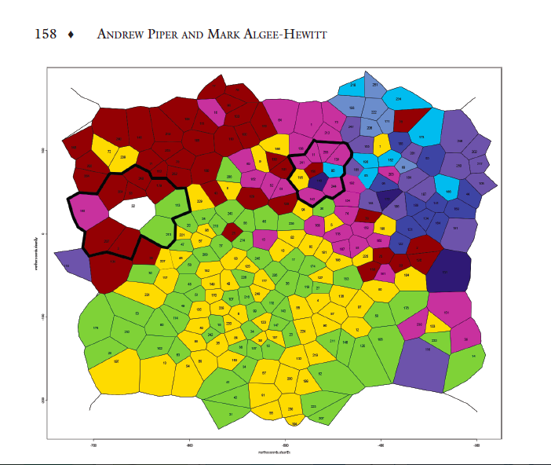
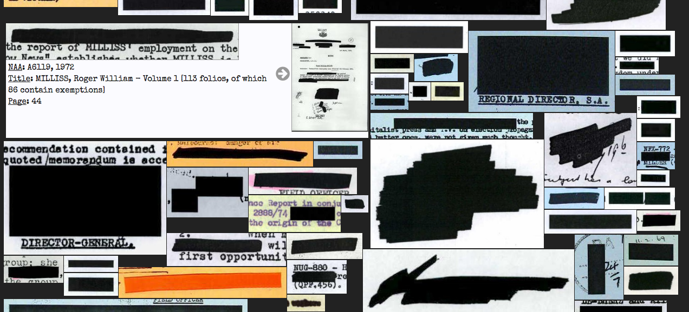
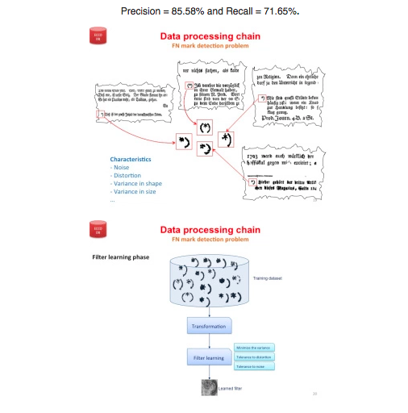
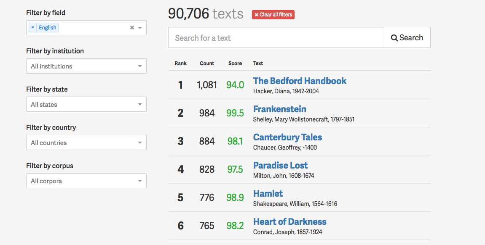
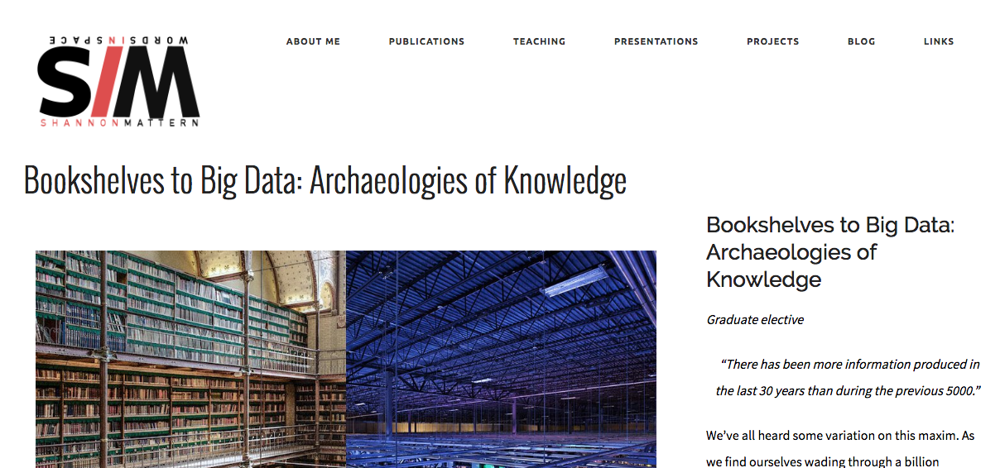

<section data-background="BuurmaImage2.jpg"></section>

---

# how to think like a humanist about information

---

_or_

---

## contingent models, counterfactual algorithms, and uncertain visualizations

<small>Follow along at [rbuurma.github.io/presentations/newschool.html](http://theotherdh.com/presentations/newschool.html)</small>
 
 <small>Rachel Sagner Buurma, Department of English Literature, Swarthmore College [@rbuurma](http://twitter.com/rbuurma)</small>
---

If you have questions while I'm speaking, feel free to

---

## some ways humanists think about information 

---
> Posner
---
> Underwood
---

---

---

## contingent models: topology

---

[<small>Andrew Piper and Mark Algee-Hewitt, "The Werther Effect I: Goethe, Objecthood, and the Handling of Knowledge."</small>](http://piperlab.mcgill.ca/pdfs/WertherEffect1.pdf)

---

> ...reading topologically illustrates the way a contingent object brings into view a contingent environment, which is then used recursively to interpret that initial object. Not only are there other Wertherisms lurking in our topology waiting to be uncovered; there are other Wertherisms waiting to be brought to light when we model Werther differently. 

[Andrew Piper and Mark Algee-Hewitt, "The Werther Effect I," 8]((http://piperlab.mcgill.ca/pdfs/WertherEffect1.pdf))

---

## counterfactual algorithms: topic modeling

---

[David Mimno and Matt Jockers, 500 topics in ~3000 novels](https://mimno.infosci.cornell.edu/novels/plot.html)

Note: no notes here

---

 
 

---

[Visualization of very handmade topics in Anthony Trollope's The Barsetshire Chronicles](http://trainorpj.github.io/barsetshire-series/)
 
 
Created by PJ Trainor in collaboration with the [Swarthmore College Victorian Novels Research Seminar](http://vic-sem-2016.github.io/) and [Nabil Kashyap](http://www.nabilk.com/)

---

## supervised machine learning 

---

## humans and machines looking at pages: visual image processing

---

[Tim Sherratt's Open with Exception project](owebrowse.herokuapp.com)

---

[The Visual Page Project, Neal Audenaert and Natalie M. Houston](http://nmhouston.com/visual-page/)

---
lots and lots of footnotes in eighteenth-century novels
---

---

---

---

---

---

---

---

---

<small>from [Andrew Piper, "Footnote Detection," .txtLab@McGill blog](http://txtlab.org/?p=395)</small>
---

## visualizing uncertaintly, outliers, + diversity 

---

add topotime image here?

---

add favored traces here?

---

---

---

 
 

reusing analog indexes

---

(your idea here)

---

new histories for thinking like a humanist about information

---

<section data-background="BuurmaImage2.jpg"></section>
[Henry Morley, Tables of English Literature (1870)](https://catalog.hathitrust.org/Record/001397737/Home)
</section>

---

---

Rickert?

---

Ann Blair, Leah Price, Robin Valenza, Richard Menke, Janine Barchas, Chad Wellmon

---

Shannon Mattern, Bookshelves to Big Data: Archeologies of Knowledge

---

<section data-background="eniacwomen.jpg">
fin fin fin 
</section>

---

> I began by showing the average lengths of titles, but I then shifted to very long and very short titles -- and I did so because these trends are much more dramatic than the slow decline of the average, and thus also much easier to talk about... But the trouble is, we literary historians don't really know how to think about what is frequent and small and slow; that's what makes it so hard to study the literary field as a whole: we must learn to find meaning in small changes and slow processes -- and it's difficult.

-Franco Moretti, *Style, Inc*

---
<section>
    
grow

    
shrink

    
fade-out

    
fade-up (also down, left and right!)

    
visible only once

    
blue only once

    
highlight-red

    
highlight-green

    
highlight-blue

</section>
---

<small>[Link to Sources for Images; all CC.]()</small>
